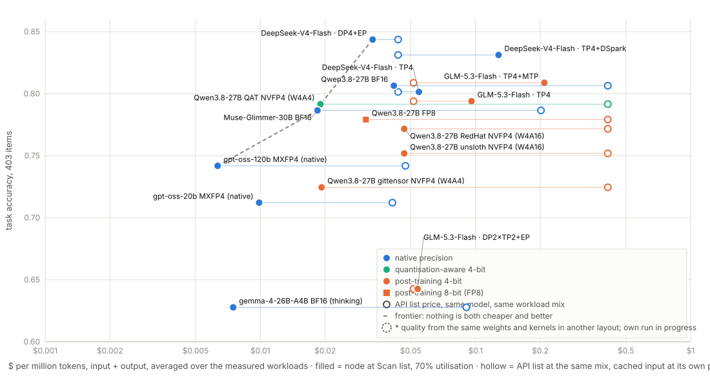

# Blackwell inference benchmarks: 4× RTX PRO 6000 and 8× RTX 5090

Measured serving throughput and quality for current open-weight models on **sm_120** — the architecture
shared by the RTX PRO 6000 Blackwell (96 GB) and the RTX 5090 (32 GB). Run by [Sqwish Labs](https://sqwish.ai)
in September 2026 to decide a two-year hardware commitment, and published because almost nothing about this
architecture is written down: the datacentre kernels (sm_100) do not run here, and the defaults are wrong in
ways that cost between 30% and 300%.

Everything here is reproducible from the scripts in `box/`. Every number is steady state with 6–8× as many
prompts as concurrent slots, a unique seed per run, and controls launched minutes apart in the same session.

**Workload shapes** (chosen for agent harnesses, not for leaderboards): `router` 1,024 in / 128 out ·
`promptopt` 3,072-token shared prefix + 512 in / 256 out · `judge` 4,096 in / 512 out · `short` 256 / 64 ·
`rollout` 8,192 / 2,048. Intelligence figures in brackets are the Artificial Analysis Intelligence Index
v4.2 (5 September 2026); a dash marks a model absent from its open-source view.

---

## The ten rules

1. **NVFP4 beats FP8 by 64%, but only if you force the kernel.** vLLM's auto-selection picks a *W4A16
   dequant* kernel for a W4A4 checkpoint and lands 47% **below** FP8. `--kernel-config.linear_backend b12x`
   or `flashinfer_b12x` are the only true W4A4 paths on this silicon. Always read the `Using … Kernel` line
   the engine prints, and force the backend.
2. **Use ModelOpt NVFP4 checkpoints, not compressed-tensors ones.** RedHat and unsloth "NVFP4" builds are
   mixed precision: attention is FP8 with *dynamic* activation scales, which the b12x kernel refuses, so they
   fall back to 2,048 out tok/s where the ModelOpt build does 5,161.
3. **Never hard-code a mixture-of-experts backend — sweep it.** `flashinfer_cutlass`, correct for gpt-oss, is
   rejected outright by any four-bit expert checkpoint with group-16 scales. Eleven arms died on this in one
   night. When the engine rejects a backend it prints the set it accepts; `triton` is not in it for NVFP4.
4. **Four replicas beat one tensor-parallel server, by several times**, whenever the model fits one card.
   There is no NVLink here; replicas exchange nothing.
5. **`--no-enable-flashinfer-autotune` on every tensor-parallel launch.** If rank 0 has a cached autotune
   result and the others do not, the ranks desynchronise in a collective and the server hangs forever.
6. **Per-architecture flags that are not optional.** Qwen3.8-Flash-Next rejects an fp8 KV cache outright
   (`Qwen4Exp QSA requires a BF16 main KV cache`). MiniMax-M3 and Inkling need `--enforce-eager` on sm_120 —
   a `KeyError: '/psm_…'` is a worker *segfault* seen from the parent, not a config error. MiniMax also needs
   `--block-size 128`; GLM-5.3-Flash needs `--block-size 1024` for the DeepGEMM indexer. DeepSeek-V4-Flash
   needs `VLLM_DSV4_OPROJ_SM120_FALLBACK=1` in the server's environment: vLLM routes its attention output
   projection through DeepGEMM's `fp8_einsum`, which has no sm_120 path and asserts during memory profiling
   for *every* MoE backend (`box/patch_oproj.py` adds the BF16 fallback that flag enables). Three sweeps
   died blaming the MoE backend and the sequence budget before the traceback's frames were read.
7. **Check `power.limit` against `power.max_limit` before trusting any host.** The same cards at 400 W
   instead of 600 W lose 23% on NVFP4 and 34% on FP8.
8. **On consumer cards, the container's CUDA must match the host driver.** The cu130 image ships a
   compatibility shim that only works on datacentre GPUs; on an RTX 5090 host with a 575 driver every launch
   dies with CUDA error 804.
9. **Serve each model the way its vendor says to, or you are benchmarking your own harness.** A missing
   `--reasoning-parser` makes the scorer grade the model's chain-of-thought; the wrong sampling costs more
   than any kernel here; and `enable_thinking` defaults differ per model, so a naive table compares some
   models thinking and others not. Worth **+0.17 aggregate** on Qwen3.8-27B — larger than every kernel
   finding in this document combined. See `box/lists/profiles.tsv`.
10. **A model that does not fit one card is a different product.** Replicas exchange nothing; tensor
    parallelism over PCIe without NVLink costs 8× throughput and turns a 0.7 s time-to-first-token into
    324 s. Decide the memory ceiling before the card count.

---

## Headline throughput

### 4× RTX PRO 6000 Blackwell, Server Edition, 600 W

Qwen3.8-27B, four replicas, one per card — the kernel comparison the whole campaign turns on. Same
checkpoint, same session, only the backend changes:

| kernel the engine used | router C256 | router C1024 | promptopt C1024 | judge C512 | tripwire |
|---|---:|---:|---:|---:|---|
| **B12xNvFp4 W4A4** (`b12x`) | 4,288 | **5,161** | 4,804 | 4,400 | 19/20 |
| **FlashInferB12xNvFp4 W4A4** (`flashinfer_b12x`) | 4,304 | **5,182** | 4,842 | 4,448 | 20/20 |
| B12xFp8BlockScaledMM (FP8 checkpoint) | 2,642 | 3,148 | 2,992 | 2,799 | 19/20 |
| FlashInferCuteDslNvFp4 **W4A16** (auto) | 1,608 | 1,671 | 1,637 | 1,621 | 19/20 |

Output tokens/s per node. The NVFP4 checkpoint is 17.9 GB against 29 GB for FP8, and *faster* — but the
auto-selected kernel is slower than FP8 and slower than it looks, because it barely moves from C256 to
C1024 while FP8 climbs 19%.

Other models on the same box:

| model (AA index) | configuration | shape | out tok/s | in tok/s | TTFT p50 |
|---|---|---|---:|---:|---:|
| gpt-oss-120b (16) | 4 replicas, FlashInfer CUTLASS + mxfp8 | promptopt C2048 | **19,689** | 275,653 | 1.5 s |
| | | router C2048 | 9,948 | 79,581 | 1.0 s |
| | | short C2048 | 16,017 | 64,066 | 1.3 s |
| | | judge C1024 | 7,468 | 59,745 | 1.4 s |
| gpt-oss-20b (–) | 4 replicas, mxfp8 activations | router C2048 | 13,752 | 110,017 | 0.7 s |
| | | judge C1024 | 9,152 | 73,217 | 1.0 s |
| | 4 replicas, Marlin (the default) | router C2048 | 9,956 | 79,649 | 1.0 s |
| gemma-4-26B-A4B (–) | 4 replicas, BF16, vendor recipe | router C1024 | 9,119 | 72,952 | 1.1 s |
| | | promptopt C1024 | 15,502 | 217,028 | 1.2 s |
| | | judge C512 | 7,229 | 57,832 | 1.4 s |
| Muse-Glimmer-30B (24) | 4 replicas, BF16, vendor recipe | router C1024 | 3,029 | 24,232 | 3.5 s |
| | | promptopt C1024 | 7,751 | 108,514 | 4.8 s |
| | | judge C512 | 2,627 | 21,016 | 4.7 s |
| DeepSeek-V4-Flash (41) | TP4, `b12x` W4A4 experts, 256 seqs (this box) | router C256 | 1,107 | 8,855 | 3.7 s |
| | | promptopt C1024 | 2,387 | 33,411 | 45.7 s ⁱ |
| | | judge C512 | 1,082 | 8,656 | 121 s ⁱ |
| | same **+ DSpark speculation** (7 draft tokens, 37% accepted) | router C256 | 665 | 5,320 | 4.8 s |
| | | promptopt C1024 | 735 | 10,293 | 125 s ⁱ |
| **DeepSeek-V4-Flash (41)** | **TP1 × DP4 + expert parallel, 512 seqs per engine** (this box) | router C1024 | **1,640** | 13,124 | 7.6 s |
| | | promptopt C1024 | **4,430** | 62,024 | 6.4 s |
| | same layout, 1,024 seqs per engine, 16k prefill batch | router C1024 | 1,584 | 12,674 | 15 s ⁱ |
| | | promptopt C1024 | 4,293 | 60,106 | 13 s ⁱ |
| | TP4, `b12x` W4A4 experts, **512 seqs** (the control) | router C1024 | 1,245 | 9,962 | 53 s ⁱ |
| DeepSeek-V4-Flash (41) | TP1 × DP4 + expert parallel, 256 seqs (first box) | promptopt C512 | 3,683 | 51,562 | 6.6 s |
| | Marlin + EP | promptopt C512 | 3,002 | 42,032 | 3.1 s |
| **Qwen3.8-Flash-Next (46)** | TP4, Marlin MoE, FP8 n-gram tables (`patch_ple.py`), auto linear kernel | router C1024 | **1,442** | 11,538 | 70 s ⁱ |
| | | promptopt C1024 | 1,919 | 26,871 | 104 s ⁱ |
| | same, `b12x` W4A4 linear kernel | router C1024 | 1,443 | 11,545 | 70 s ⁱ |
| **GLM-5.3-Flash (46)** | TP4, ported vendor vLLM, 256 seqs | promptopt C256 | 1,002 | 14,030 | 2.7 s |
| | | router C256 | 920 | 7,362 | 2.2 s |
| | | judge C128 | 771 | 6,165 | 2.1 s |
| | TP4, **512 seqs**, 16k prefill batch | router C1024 | 911 | 7,288 | 64 s ⁱ |
| | | promptopt C1024 | 992 | 13,887 | 115 s ⁱ |
| | TP4 + **expert parallel**, 512 seqs | router C1024 | 931 | 7,449 | 62 s ⁱ |
| | | promptopt C1024 | 1,008 | 14,108 | 120 s ⁱ |
| | TP4, 512 seqs, **MTP speculation** (3 draft tokens, 10% accepted at this batch) | router C1024 | 592 | 4,738 | 101 s ⁱ |
| | TP1 × DP4 + expert parallel, 192 seqs per rank (the build's cap at TP1) | router C1024 | 1,073 | 8,585 | 97 s ⁱ |
| | DP2 × TP2 + expert parallel, 384 seqs per rank — **rejected by quality tripwire** | router C1024 | 1,300 (diagnostic only) | 10,397 | 72 s ⁱ |

ⁱ Time-to-first-token here is queueing: the server admits 256 or 512 sequences and the shape offers 1,024.

**GLM's ceiling was a step-time ceiling, and the step time was tensor parallelism.** At TP4, doubling the
sequence budget from 256 to 512 and sharding the experts changed output throughput by 1% and 2%: the decode step
took about 200 ms at every setting, and that time is the four-way all-reduce over PCIe with no NVLink, plus a
Hopper attention backend ported to sm_120 and a 1,024-token DeepGEMM indexer block. Remove the all-reduce —
four independent engines with the experts sharded across them (TP1 × DP4 + EP) — and the step drops to 93 ms
and output rises to 1,073 tokens a second, +15%. It is not more because the vendor build caps a TP1 rank at 192
sequences (its linear-attention state cache), so the batch is shallower even though each step is twice as fast.
**The faster DP2 × TP2 + EP run is not a usable winner:** its own 20-item tripwire reports eight degenerate
outputs and one wrong answer. Its 1,300 tokens/s cannot be combined with quality measured at TP4. DP4 × TP1 + EP
passed all 20 tripwire items and is the candidate for a fresh full evaluation. Growing its Mamba cache remains
an unmeasured throughput opportunity. The build refuses the `flashinfer_b12x` expert kernel for this model
(`swiglu_limit` clamp not implemented); the captured DP runs actually selected `FLASHINFER_CUTLASS` NVFP4 MoE.
The MTP head makes it *worse* at saturation — 592 against 911, because only 10% of drafted tokens are accepted at
1,024 streams and every rejected draft is a wasted slot in a batch that was already full. The 403-item quality
run must apply to the exact accepted layout. The baseline uses NVFP4 expert weights and BF16 KV; the proposed
BF16 SSM-state and FP8 KV arms in `box/glm_perf3.sh` change precision and require their own paired quality gate.
The reversible FA2 planned-length diagnostic is documented in [patches/glm_fa2_plan_audit.md](patches/glm_fa2_plan_audit.md).

**DeepSeek's ceiling was a layout ceiling, and it moved.** Tensor-parallel across four cards gave 1,107 output
tokens a second. Four independent engines with the experts sharded across them (TP1 × DP4 + EP), each admitting
512 sequences, give **1,640 at 1,024 concurrent streams — 48% more from the same weights and kernels**, because
each card decodes its own batch and only the expert dispatch crosses PCIe. On shared-prefix traffic the gap is
wider still: **4,430 against 2,387, +86%**, because prefix caching is per engine and four engines each hold the
whole prefix. The price is per-stream latency: 581 ms per token at that load on the router shape, 7.6 s to first
token. At 256 streams the same layout gave 1,289 (first box), so the gain is mostly batch depth that TP4 could
not reach — but not only that: TP4 given the same 512-sequence budget reaches 1,245 (+14% over its 256-sequence
number), so batch depth helps both layouts and the layout itself is worth **+32% at equal depth**. Raising the
per-engine budget to 1,024 sequences changed nothing, because 1,024 streams across four engines is 256 each. The
W4A4 expert kernel that gave TP4 its +5% is not available in this layout: the `b12x` MXFP4 MoE backend refuses
`dp_size=4, ep_size=4` outright ("does not support the deployment configuration"), so the DP4 + EP numbers are on
the Marlin MXFP4 path, and a W4A4 expert kernel that shards would be the next lever. **Its 403-item quality run
on this layout scored 0.844** — the best score measured without a drafter, 0.030 above the same weights and
expert kernel at TP4, at the edge of the suite's 0.022 repeat spread: the layout costs nothing in quality and may
have bought a little (fewer truncations at 4.2% against 5.5%). Its 403-item quality run on this layout is in progress;
the same weights and MoE kernel scored 0.814 at TP4.

GLM-5.3-Flash is the highest-intelligence open model that fits in 384 GB at all — four points below the top
open score (Kimi K3, 50), which only 750B–2.8T models reach. Getting it to produce *correct* output on this card took a
day; see "GLM-5.3-Flash" below.

### 4× RTX PRO 6000 Blackwell, Workstation Edition, 400 W cap

**These throughput numbers do not transfer to a purchase.** Scan sells the Server Edition; this host caps
the same silicon at 400 W and loses 23% on NVFP4 and 34% on FP8 for that alone. The rows below are kept
because they are internally consistent — same box, same session, same controls (`c6_*` in `results/`) — so
they rank configurations and prove models feasible. For anything absolute, use the 600 W section above.
Quality scores are the exception: accuracy does not depend on the power limit, so eval results from either
box are directly comparable, which is why both hosts run the quality suite.

| model (AA) | shape | out tok/s | in tok/s | TTFT p50 | tripwire |
|---|---|---:|---:|---:|---|
| gpt-oss-20b (–), 4 replicas | promptopt C256 | **13,442** | 188,192 | 0.6 s | 20/20 |
| | router C256 | 10,291 | 82,332 | 0.7 s | |
| Nemotron-3.5-Lightning-30B (16, estimate) | router C256 | 8,037 | 64,296 | 1.2 s | 18/20 |
| | judge C128 | 6,317 | 50,533 | 1.0 s | |
| Qwen3.6-35B-A3B (–) | promptopt C256 | 7,680 | 107,518 | 1.2 s | 16/20 |
| | router C256 | 6,903 | 55,220 | 0.8 s | |
| gemma-4-26B-A4B (–) | promptopt C256 | 7,705 | 107,870 | 1.1 s | 19/20 |
| gemma-4-26B-A4B **+ official MTP** | promptopt C256 | **9,560** | 133,834 | **0.22 s** | 20/20 |
| | judge C128 | 4,720 | 37,764 | 0.47 s | |
| Laguna-S-2.1 (agentic coder) | promptopt C256 | 4,527 | 63,382 | 1.6 s | 20/20 |
| | router C256 | 2,850 | 22,803 | 1.2 s | |
| Laguna-S-2.1 **+ DFlash drafter** | judge C128 | **2,455** | 19,643 | **0.63 s** | 20/20 |
| Nemotron-3-Super-120B (–) | router C256 | 2,845 | 22,761 | 1.9 s | 20/20 |
| Qwen3.8-27B **+ DFlash2 drafter** | judge C128 | 2,682 | 21,458 | 1.0 s | 20/20 |
| Ornith-1.5-397B | router C256 | 877 | 7,017 | 2.4 s | 20/20 |
| Hy3 (–) | promptopt C256 | 1,821 | 25,488 | 3.6 s | 20/20 |

**Speculative decoding buys latency, not throughput.** Every drafter measured loses output tokens per second
at saturation and cuts time-to-first-token by 2–5×: Nemotron-3.5 with NVIDIA's DSpark drafter goes from
1,161 ms to 244 ms TTFT while output drops from 8,037 to 4,305 tok/s. For an interactive agent that is the
right trade; for batch rollouts it is not. The two exceptions are gemma-4-26B's official MTP head and
Laguna's DFlash, which win on *both* axes.

### 8× RTX 5090 (32 GB), 400 W — the same monthly price

Scan sells an 8× RTX 5090 machine for **the same £1,999.98/month** as the 4× RTX PRO 6000, so this is a
straight read of throughput per pound: twice the tensor cores, a third of the memory each, 256 GB aggregate
against 384 GB.

| model | best kernel pair found | router C1024 | promptopt C1024 | judge C512 |
|---|---|---:|---:|---:|
| gpt-oss-20b | mxfp8 activations | **25,634** | **39,529** | 16,790 |
| gemma-4-26B-A4B NVFP4 | engine auto | 15,674 | 27,696 | 13,478 |
| Nemotron-3.5-Lightning-30B NVFP4 | `b12x` + Marlin experts | **16,154** | 10,773 | **13,838** |
| Qwen3.6-35B-A3B NVFP4 | `b12x` + Marlin experts | 13,654 | 15,352 | 10,212 |
| Muse-Glimmer-30B NVFP4 | `b12x` + FlashInfer CUTLASS | 9,782 | 23,833 | 8,056 |
| Qwen3.8-27B NVFP4 | `b12x` | 6,558 | 4,889 | 5,237 |

Head to head on the identical checkpoint, kernel and shapes:

| Qwen3.8-27B NVFP4, `b12x`, one replica per card | 4× PRO 6000, 600 W | 8× RTX 5090 | Δ |
|---|---:|---:|---:|
| router C256 | 4,288 | 6,445 | **+50%** |
| router C1024 | 5,161 | 6,558 | **+27%** |
| judge C512 | 4,400 | 5,237 | **+19%** |
| promptopt C1024 | 4,804 | 4,889 | +2% |
| KV cache per server | 1,500,000 tokens | 181,000 | −88% |

The consumer node wins everywhere and wins hugely on short-prompt routing; the advantage collapses to
nothing on shared-prefix traffic, where 32 GB per card leaves an eighth of the cache and the scheduler
queues instead of batching. Caveats worth carrying: this rented host is dual-socket (Scan's is not, so its
tensor-parallel tiers should be better than measured here), and its cards are also capped at 400 W.

**And then the memory ceiling arrives.** Everything above is a model that fits on one card. A model that
does not is forced into tensor parallelism across cards with no NVLink, where the 96 GB box still runs
independent replicas that exchange nothing. gpt-oss-120b is the one model measured both ways:

| gpt-oss-120b, same MoE kernel | 4× PRO 6000, four TP1 replicas | 8× RTX 5090, two TP4 groups |
|---|---:|---:|
| router, out tok/s | **13,752** (C2048) | 1,640 (C1024) |
| prompt-optimisation | **19,689** | 3,352 |
| judge | **9,152** | 1,578 |
| TTFT p50 | **0.7 s** | **324 s** |

Eight times the throughput and three orders of magnitude on time-to-first-token. That is not a tuning gap,
it is the configuration: 61 GB fits a 96 GB card and does not fit a 32 GB one. Two further tensor-parallel
arms failed there outright — Ling-3.0-flash needs 102,400 bytes of shared memory against the 101,376 the
architecture allows, and Qwen3.8-Flash-Next rejects an fp8 KV cache. **So the consumer box is the better
buy for high-volume work on models under ~30 GB, and the wrong buy for anything frontier-class**, which on
this roster means DeepSeek-V4-Flash (167 GB) and GLM-5.3-Flash (198 GB). Both are queued at TP8 there to
put a number on it rather than an inference.

---

## GLM-5.3-Flash: getting the index-46 model to work

Neither vLLM 0.28.1 nor SGLang 0.5.18 knows the `glm5_next` architecture; both vendors ship it as a
per-model Docker image. `box/pull_image.py` lifts those images' Python trees over the registry API without
Docker.

* **The vLLM route works.** Its only sm_120 sparse-attention backend is hard-wired to DeepSeek's cache
  layout (`pe_dim` 64; GLM has 0). Its Hopper NoPE backend supports that but was gated to major 9 and built
  on FlashAttention-3. `box/vllm_sm120_nope.py` widens the gate to major 12 and rebuilds the wrapper on
  FlashInfer's FA2 path. With `--block-size 1024` (DeepGEMM's paged-MQA indexer accepts arch 12 only at
  particular block sizes) and autotune off, it serves TP4 with a 2.14M-token KV cache and passes 18/20 on
  the chat tripwire.
* **The SGLang route does not.** Nine blockers cleared, server healthy in 135 s, prefill exact after a
  dense-prefill patch — and decode still drifts into loops. Ten discriminators cleared CUDA graphs, MTP, the
  MoE runner, TileLang tiles, PDL, the indexer, conv and SSM dtype. The TileLang sparse *decode* kernel is
  what is left. Documented in `notes/` rather than swept under it.

Credit: the DGX Spark (GB10, sm_121) community had already hit most of these and published fixes.

---

## Quality

Throughput numbers are worthless without a quality gate, and string comparison of greedy generations is not
one — a single differing token cascades, and it cannot tell better from worse. Three layers here:

**1. A corruption tripwire** (`box/quality20.py`), run on every configuration before it is benchmarked: 20
fixed prompts through the model's own chat template, a repetition detector (repeated 6-grams, distinct-token
ratio) and expected substrings. Reported as `ok/degenerate/wrong` in every table above. The first version of
this passed GLM output reading "111 222 333 444"; do not trust a tripwire that only checks for `!!!!`.

**2. Logit-level divergence** (`box/logit_diff.py`), for questions a task benchmark cannot resolve: identical
contexts on two servers, twenty log-probabilities per position, and a control pair that fixes the noise
floor.

Qwen3.8-27B, ~104 positions per pair, 600 W box. **Read every row against the control**, which is the same
configuration served twice:

| pair | top-1 agreement | mean KL | verdict |
|---|---:|---:|---|
| **control** — same config, twice | **0.9615** | **0.01840** | the noise floor |
| `b12x` vs `flashinfer_b12x` | 0.9904 | 0.00158 | **below** the floor — the two W4A4 kernels are interchangeable |
| fp8 KV cache vs bf16 | 0.9417 | 0.02555 | just above: excess KL +0.007 |
| **NVFP4 (community PTQ) vs FP8** | **0.8190** | **0.14515** | **excess KL +0.127, seven times the floor** |

Three things this settles that task accuracy could not.

**The stack is not deterministic**, and the control quantifies it: two identical servers disagree on 3.8%
of top-1 tokens. Prefix caching, atomics in MoE and attention reductions, and continuous batching all
contribute. Any claim resting on reproducing an output exactly — including "speculation must be
bit-identical" — is unfounded here, which is why the greedy sequence comparison in `box/specdiff.py` now
refuses to draw a conclusion unless its own control reproduces.

**The two four-bit kernels are equivalent**, and by a wide margin: they agree with each other *better* than
one configuration agrees with itself. Choosing between `b12x` and `flashinfer_b12x` is a throughput
decision only.

**Four-bit post-training quantisation really does change the model.** 18% of top-1 tokens differ from the
FP8 release — not a subtle shift, and measured without a single task, token cap or scorer involved. It
corroborates the maths gap seen in the task suite (0.650 against 0.939) through a completely independent
instrument, which is the strongest form of agreement available here.

For fp8 KV cache on gpt-oss, measured earlier the same way:

| metric | control: fp8 vs fp8 | treatment: fp8 vs bf16 | excess |
|---|---:|---:|---:|
| top-1 token agreement | 0.988 | 0.925 | −0.062 |
| top-5 overlap | 0.988 | 0.965 | −0.023 |
| mean KL divergence | 0.0053 | 0.0589 | **+0.054** |

**3. A task-accuracy suite** (`box/evalsuite/`), 435 items across six capability families — contest
mathematics, code executed against its tests in a sandbox, tool calling matched against the Berkeley
function-calling answer sets, synthetic long-context retrieval calibrated to the served window, ten-option
knowledge questions and short-answer factuality, and instruction following with two dozen checkers
re-implemented from the reference. Ungated public sources, programmatic scoring, no model judging another
model, Wilson intervals, and the same items and seed across configurations so arms are directly pairable.

### Task accuracy, served the way each vendor says to

Six capability families, 403 items, one seed, no token cap, each model with its own reasoning parser,
chat-template flags and sampling recipe. Accuracy does not depend on the power limit, so results from both
4× RTX PRO 6000 hosts are pooled; the host is noted where it matters.

| model (AA index) · configuration | items | overall | maths | code | tools | long ctx | knowledge | instructions |
|---|---:|---:|---:|---:|---:|---:|---:|---:|
| **GLM-5.3-Flash (46)** · NVFP4, TP4, **MTP speculation** | 403 | **0.809** | 0.812 | 0.773 | 0.900 | 0.917 | **0.614** | 0.883 |
| **DeepSeek-V4-Flash (41)** · native MXFP4 + FP8, **TP1 × DP4 + EP**, Marlin experts, no speculation | 403 | **0.844** ⁴ | 0.938 | 0.747 | 0.900 | 0.938 | 0.643 | **0.933** |
| **DeepSeek-V4-Flash (41)** · native MXFP4 + FP8, TP4, **DSpark speculation** | 403 | 0.831 ⁴ | 0.938 | 0.720 | 0.871 | 0.958 | **0.657** | 0.883 |
| DeepSeek-V4-Flash (41) · native MXFP4 + FP8, TP4, Marlin experts, no speculation | 403 | 0.814 ⁴ | 0.912 | 0.707 | 0.871 | 0.938 | 0.643 | 0.850 |
| DeepSeek-V4-Flash (41) · native MXFP4 + FP8, TP4, no speculation | 403 | 0.801 ⁴ | 0.912 | 0.680 | 0.886 | 0.938 | 0.586 | 0.850 |
| GLM-5.3-Flash (46) · NVFP4, TP4, no speculation | 403 ³ | 0.794 | 0.738 | 0.760 | **0.914** | 0.958 | 0.600 | 0.867 |
| GLM-5.3-Flash (46) · NVFP4, **DP2 × TP2 + EP** — the 1,300 tok/s layout | 403 | **0.643** ⁶ | 0.562 | 0.640 | 0.714 | 0.917 | 0.543 | 0.567 |
| Qwen3.8-27B (41) · **native BF16**, 4 replicas | 403 ⁵ | 0.806 | 0.800 | **0.813** | 0.900 | **0.979** | 0.500 | **0.917** |
| Muse-Glimmer-30B (24) · BF16 | 403 | 0.787 | 0.938 | 0.800 | 0.814 | 0.812 | 0.486 | 0.867 |
| Qwen3.8-27B (41) · **FP8**, 4 replicas | 403 | 0.779 | 0.863 | 0.720 | 0.843 | **0.979** | 0.471 | 0.867 |
| Nemotron-3-Super (–) · **native** NVFP4 | 379 ¹ | 0.776 | 0.946 | 0.800 | 0.900 | 0.729 | 0.500 | 0.800 |
| Qwen3.8-27B (41) · NVFP4, RedHatAI | 403 | 0.772 | 0.750 | 0.760 | 0.857 | 0.938 | 0.486 | **0.917** |
| Step-3.7-Flash · NVFP4 | 403 | 0.767 | 0.688 | 0.760 | 0.871 | 0.958 | 0.529 | 0.883 |
| Qwen3.8-27B (41) · NVFP4, unsloth | 403 | 0.752 | 0.738 | 0.760 | 0.814 | 0.938 | 0.471 | 0.867 |
| gpt-oss-120b (16) · native MXFP4 | 403 | 0.742 | 0.731 | **0.933** | **0.923** | 0.857 | 0.385 | 0.700 |
| Qwen3.8-27B (41) · NVFP4, gittensor (the fast build) | 403 | 0.725 | 0.650 | 0.680 | 0.843 | 0.917 | 0.471 | 0.883 |
| gpt-oss-20b (–) · native MXFP4 | 403 | 0.712 | 0.700 | 0.773 | 0.857 | 0.833 | 0.429 | 0.717 |
| Qwen3.6-35B-A3B · FP8 | 403 | 0.702 | 0.537 | 0.627 | 0.871 | 0.958 | 0.543 | 0.800 |
| gemma-4-26B-A4B · BF16, thinking on, T=0 | 403 | 0.628 ² | 0.812 | 0.560 | 0.843 | 0.604 | 0.286 | 0.633 |

¹ The first pass of several runs lost items to the eval runner's default **600-second request timeout** — the
*hardest* items, since they are the ones that run long, so a row missing them is flattered. Completing them
under the same tag and caps moved every affected row down, as predicted: GLM 0.861 → 0.794 (see ³), Qwen FP8
0.789 → 0.779 (maths 0.939 → 0.863), Muse 0.794 → 0.787 (maths 1.000 → 0.938). Nemotron-3-Super is the one row
still short (379 of 403); it was on the box that could not restart. Every eval now runs with an hour per request.
² 28.5% of gemma's answers were truncated at the cap: at T=0 with thinking on it does not converge. The
vendor default is thinking *off*; both modes are being measured (`box/lists/thinkmode6000.txt`).
³ GLM without speculation scored **0.872 on the 367 items it finished** in its first pass; completing the 36
timed-out items took it to 0.794, because 20 of 80 maths items and 9 of 75 code items **ran past 32,768
output tokens** at `reasoning_effort: max` and a truncated answer scores as wrong. That is the cap binding,
not the model failing: the two GLM rows are within noise of each other (paired 13 vs 10 on the items both
scored), and a 65k-token arm is queued to measure what the 32k cap costs.
⁴ DeepSeek-V4-Flash is served at the precision it was trained at, so this row has no quantisation loss in it.
It lost no items to the timeout, but **17% of its code answers ran past the 20,480-token cap** (6% of maths
past 32,768): like GLM, it reasons past the caps that were generous for every smaller model. A 65k-token arm
is queued for it too. Statistically it ties GLM — the two are inside each other's intervals.
⁶ The fast expert-parallel layout's outputs are degraded on this vendor build: truncation 16% against 8% at TP4,
2.7% degenerate answers, mean answer 6,320 tokens against 4,138. Every family fell, instruction-following most
(0.567 against 0.867). Same weights, same kernels, different parallel layout — the layout is the variable, and
two isolation runs (TP4 + EP alone; DP2 × TP2 without EP) are measuring which half of it breaks the model.

**The published intelligence index does predict this.** GLM-5.3-Flash at index 46 leads, and it leads on the
families that separate models rather than saturate: maths, knowledge and long context. An earlier version of
this file claimed the opposite — that small models beat it and the index was useless for our workloads. That
claim was an artefact of a broken harness, not a finding, and it is withdrawn. What survives is narrower and
more useful: **gpt-oss is disproportionately good at code and tool calling for its size**, which is what an
agent harness spends most of its time doing, and index 16 buys 0.933 on code where index 46 buys 0.864.

The v4.2 chart, sized against 384 GB: every model above GLM-5.3-Flash overflows the node — **Kimi K3 (50) is
2.78 trillion parameters** (a community W4A4 build exists, at ~1.4 TB), GLM-5.3 (49) is 753B and ~450 GB at
four-bit, Qwen3.8-2.4T-A95B (47) and DeepSeek V4 Pro 0813 (42, 1.65T) are larger still. So 46 stays the
ceiling: 92% of the top open score. Below it, the one fittable model not yet measured is **K2 Horizon
375B-A23B (38)** — MBZUAI's IFM, released 1 September, Apache-2.0, 23B active. Its FP8 release is 375 GB and
does not fit; a four-bit build (~225 GB) would, and none exists yet; the `k2_horizon` architecture is custom
code with no engine support confirmed. It is on the roster as blocked on a quantisation. DeepSeek-V4-Flash does fit — 156 GB, native MXFP4 experts and FP8 attention — and scores 0.801 above,
after three failed launches: one hard-coded a MoE backend this build rejects, two blamed the wrong flag for a
DeepGEMM assertion that was the attention output projection needing its sm_120 fallback (rule 6).

Per-family intervals at these counts are roughly ±0.10, so family-level ordering is indicative and the
aggregate is where the ±0.045 applies. Rows are comparable only on the items both scored, which is why every
paired claim below is made on the common item set rather than on the headline column.

### The same suite against the API

The question behind the economics is whether the endpoint a customer buys at list price scores what the weights
score on this node. So the 403 items run against OpenRouter too — default routing, the vendor's own sampling
recipe, the same per-family caps, from the third box beside the GPU work (`box/or_eval.sh`; the key lives on the
box, never in the repository or this chat). One model has finished; the others follow in the order of the table.

| model | on this node (best quality-safe config) | OpenRouter endpoint, same 403 items | gap | where the gap is |
|---|---:|---:|---:|---|
| GLM-5.3-Flash | 0.794 · NVFP4, TP4 (0.809 with MTP) | **0.824** | +0.030 (+0.015 vs MTP) | maths 0.812 vs 0.738, code 0.813 vs 0.760, knowledge 0.657 vs 0.600; ifeval and tools slightly lower |
| DeepSeek-V4-Flash | 0.844 · native, DP4 + EP | **0.784** | −0.060 | long context 0.833 vs 0.938, maths 0.875 vs 0.938, knowledge 0.571 vs 0.643, code 0.707 vs 0.747; the endpoint truncates 9.2% of answers against 4.2% here and 3.0% degenerate into repetition against 0.25% |
| Qwen3.8-27B | 0.806 · BF16 (0.792 QAT NVFP4) | queued | | |
| gpt-oss-120b, gpt-oss-20b, Muse, gemma, MiniMax | see leaderboard | queued | | |

The two results point opposite ways, and both are about the *deployment*, not the weights. GLM's endpoint
beats our four-bit build by the size of a quantisation cost, because Z.AI serves the model at training
precision. DeepSeek's endpoint loses 0.060 to our native-precision run — three times the noise floor — with
twice the truncation and twelve times the degenerate output, which is what a provider running the model too
hot or on a lossy build looks like. OpenRouter's default routing picks whichever provider is cheapest and
available, and the response does not say which one answered; a customer paying list price gets that provider.
"API quality" is a property of the routed deployment, and it has to be measured per provider before it can be
compared with a node that serves the weights as released.

The GLM gap is at the edge of the suite's 0.022 noise floor and lands exactly where the quantisation ladder said
quantisation lands — maths, code, knowledge — while the endpoint's truncation rate (6.2%) and mean answer length
(4,354 tokens) match ours. Z.AI serves the model at its training precision; we serve a post-training NVFP4 build.
The native-FP8 GLM run queued on the original box is the direct test of that reading.

### Speculation is lossless — measured properly this time

GLM-5.3-Flash scored 0.800 without its MTP head and 0.740 with it on the 400 W box, and the previous version
of this file called that a bug in the speculator. It was not. A greedy sequence test could not settle it — its
own control, the same server captured twice, matched on only 4 of 12 — so the question was put to the task
suite as a **paired comparison on the items both arms actually scored**, same 600 W box, same recipe, same seed:

| GLM-5.3-Flash, 367 common items | accuracy | truncated | mean output tokens |
|---|---:|---:|---:|
| no speculation | 0.872 | 0.000 | 1,996 |
| MTP, 3 speculative tokens | 0.864 | 0.003 | 2,254 |
| items only one arm got right | 13 base · 10 MTP | | |

Thirteen against ten is a coin toss. The earlier gap came from comparing arms scored on **different item
sets** under a cap that marked truncation wrong — and the MTP arm, being faster, was the one that finished the
36 items the base arm timed out on. Speculation did not cost GLM anything; it bought the hardest items within
the same wall-clock. The logit-level pass (above) is the other half of the answer: two identical servers
differ on 3.8% of top-1 tokens, so no test that demands bit-exact output can attribute anything on this
stack, and `box/specdiff.py` now refuses to.

Lossless is not free, though. **At saturation, speculation costs throughput on this node.** GLM's MTP head at
1,024 concurrent streams: 592 output tokens a second against 911 without it, with only 10% of drafted tokens
accepted at that batch (the 67% acceptance seen earlier was at low concurrency). DeepSeek's DSpark drafter: 665
against 1,107. A drafter buys per-request latency when the box is lightly loaded and sells aggregate throughput
when it is full; for batch and agent-harness traffic on this node, run without it.

The second model says the same thing from the other side. DeepSeek-V4-Flash with NVIDIA's DSpark drafter
(7 draft tokens a step, 37% of them accepted) scored **0.831 against 0.801 without it** (with the W4A4 expert
kernel; the same layout on the Marlin expert kernel scored 0.814 without a drafter), all 403 items both
times, paired 19 to 7 in the *drafter's* favour. A drafter cannot make the model smarter — with probabilistic
drafting and rejection sampling the target distribution is preserved by construction — so a 19-to-7 split at
temperature 1.0 is a reading of the **suite's own run-to-run noise** at vendor sampling, not of speculation.
The next section measures that noise.

### The suite's noise floor

Four configurations were evaluated on both PRO 6000 hosts under byte-identical recipes — same items, same
seed, same sampling, same caps, same parser — which makes each pair a same-configuration-twice control:

| same configuration, twice | items in common | run A | run B | aggregate gap | items only A / only B got right |
|---|---:|---:|---:|---:|---:|
| Qwen3.8-27B NVFP4 (gittensor), b12x | 403 | 0.725 | 0.747 | 0.022 | 11 / 20 |
| Qwen3.8-27B FP8, b12x | 380 | 0.787 | 0.795 | 0.008 | 6 / 9 |
| Muse-Glimmer-30B BF16 | 373 | 0.791 | 0.780 | 0.011 | 13 / 9 |
| gemma-4-26B-A4B BF16, thinking on, **T = 0** | 396 | 0.634 | 0.616 | 0.018 | 28 / 21 |

So a repeat of the *same* configuration moves the aggregate by up to 0.02 and flips 15 to 50 items, with paired
splits as lopsided as 11 to 20. Read every comparison in this file against that: **DeepSeek's 19-to-7 for its
drafter and GLM's 13-to-10 for its MTP head are inside the floor** (speculation is lossless, and not better);
FP8 against the gittensor four-bit build at 29-to-14 and 0.040 is outside it, but not by a wide margin;
RedHat's "parity" with FP8 (0.801 against 0.802) means *indistinguishable*, not equal; and the order of
adjacent rows in the leaderboard is not a finding. The gemma pair is the sharpest lesson: at temperature 0 —
greedy — 49 items still changed verdict between two identical servers, which is the logit-level control's
3.8% top-1 disagreement cascading through whole answers. Nothing on this stack reproduces bit-for-bit, and
the eval suite inherits that. A third repeat of the Qwen NVFP4 row is queued on the 600 W box to put a
second point on the floor.

### How to serve a model without accidentally measuring your own harness

The first round of quality numbers here was wrong, and the way it was wrong is the most useful thing in
this repository. Serving every model with one house default produced a table in which every model that
*reasons* scored below every model that does not — which reads like a finding and is in fact three bugs.

**The same weights, the same hardware, the same 403 items. Only the serving changed:**

| Qwen3.8-27B NVFP4 | house default | vendor recipe | |
|---|---:|---:|---|
| **overall** | 0.558 | **0.732** | |
| instruction following | 0.317 | **0.833** | its chain-of-thought was the graded answer |
| code | 0.413 | 0.733 | |
| maths | 0.525 | 0.625 | |
| tools | 0.829 | 0.900 | |
| long context | 0.917 | 0.979 | |
| truncation rate | 0.248 | 0.139 | |

Three independent errors, each worth more than any kernel choice in this repository:

1. **No reasoning parser.** vLLM registers one per family — `qwen3`, `glm45`, `muse_glimmer`, `nemotron_v3`,
   `ling3`, `minimax_m3`, `inkling`, `hy_v3`, `step3p5`, `poolside_v1`, `mimo`, `deepseek_v4`, `gemma4`,
   `openai_gptoss` — and we passed none. Without one the chain-of-thought is returned as the answer.
   It hides well: Qwen3-family templates put the opening `<think>` in the *prompt*, so the model emits only
   a closing `</think>` and the output reads as ordinary prose. 306 of 403 responses, and 21 of 60
   instruction items began "We need answer user's request…".
2. **A token cap.** A truncated answer was scored *wrong*. GLM-5.3-Flash lost 51% of the maths items that
   way. Cap generation just under the context window and let the *time* budget be the only limit — running
   out of time marks an item skipped, which is excluded from the accuracy.
3. **Sampling, and whether the model is even thinking.** Not one vendor recommends greedy or T=0.6. Qwen
   wants T=1.0/top_p=0.95/top_k=20/min_p=0 in thinking mode, gemma-4 T=0.0/top_k=64, Ling-3.0 T=0.85,
   Hy3 T=0.9/top_p=1.0. `top_k` and `min_p` have no slot in the OpenAI schema and must go through
   `extra_body` or they silently do not apply. And thinking is not on by default everywhere: **Hy3 defaults
   to `no_think` and gemma-4 to `enable_thinking: false`**, while Qwen, Inkling, MiniMax, Nemotron, Ling and
   Ornith default on — so a naive table compares models in two different modes.

`box/lists/profiles.tsv` carries the researched recipe per model (parser, tool parser, template kwargs,
sampling), applied by the harness to both the server and the eval client. Every pre-fix run is kept under
`results/eval/capped/`, `no_parser/` and `pre_profiles/` so the size of each artefact stays measurable.
The re-run under these recipes is what the table above reports.

### Four quantisers of one model, on both axes at once

Throughput and quality are not a choice to make separately, so here they are together: the same
Qwen3.8-27B weights through four quantisers, four TP1 replicas on the 600 W box, router at concurrency
1,024 for speed and the 403-item suite for accuracy, one recipe and one seed throughout.

Quality is given two ways: over every item the run scored, and over the **388 items all four runs scored**
(the FP8 run lost 15 to the request timeout), which is the only column on which the builds are comparable.

| build | quantiser | kernel the engine used | out tok/s | quality (all scored) | quality (388 common) | maths (common) |
|---|---|---|---:|---:|---:|---:|
| NVFP4 · gittensor (ModelOpt) | post-training | B12xNvFp4 **W4A4** | **5,161** | 0.725 | 0.762 | 0.785 |
| **FP8 · Qwen's own release** | vendor | B12xFp8BlockScaledMM | 3,148 | 0.789 | **0.802** | **0.938** |
| NVFP4 · RedHatAI | post-training | auto: FP8 attention + dequant MLP | 2,048 | 0.772 | **0.801** | 0.862 |
| NVFP4 · unsloth | post-training | auto: same | 2,048 | 0.752 | 0.786 | 0.862 |

Three things fall out, and only the first was expected.

**On throughput the frontier has exactly two points.** The gittensor build (5,161 tok/s) and the official FP8
build (3,148). The other two four-bit builds were served under the auto kernel, which cannot use the W4A4
path for compressed-tensors checkpoints and falls back to FP8 attention with a dequantised MLP — slower than
FP8 itself. As measured, choosing them is never right on speed.

**One more thing the fast build changes: the prompt.** Its `chat_template.jinja` is a 14 KB rewrite of Qwen's
9 KB template (which is byte-identical across the BF16, FP8, QUASAR and MTP checkpoints): it injects an extra
instruction sentence whenever tools are present, adds `<|think_on|>`/`<|think_off|>` toggles and re-derives
the reasoning block from message content. So every comparison against that build so far conflates its
*weights* with its *prompt*. An arm serving the gittensor weights under the official template is queued
(`box/lists/control600w.txt`); until it lands, "gittensor" below means weights *and* template.

**On quality, RedHat's four-bit build is at parity with FP8** — 0.801 against 0.802 on the common items —
while the build every throughput number in this repository was measured on is the weakest of the three:
0.762, and the FP8-vs-gittensor pair is a real difference (29 items only FP8 got right against 14 only
NVFP4 got right, on 388 paired items). We picked the gittensor build for kernel compatibility, not for
measured quality. So the open question is now sharp: **does RedHat's build load under the W4A4 kernel?** If
it does, it is the Pareto point — FP8 accuracy at 5,000 tok/s — and that run is queued (`box/lists/fix600w.txt`).

**The cost that remains is concentrated in mathematics — with a caveat the numbers themselves raise.** Even
the parity build gives up 0.076 on maths (0.862 against 0.938); the gittensor build gives up 0.153. Code,
tools, long context and instruction following are within noise for all three. But look at how these models
answer a maths item at Qwen's own sampling: mean output **9,300 tokens for FP8, 12,100 for RedHat, 13,900 for
gittensor, and 14,300 for the native BF16 parent**, with 3%, 26%, 35% and 19% of items hitting the 32,768
cap respectively — and a capped item scores as wrong. Two things follow. FP8's low truncation is partly
because its 15 *longest* items were the ones the request timeout removed, so its maths lead will shrink when
those are completed. And the native BF16 parent — 0.806 overall, 0.800 on maths, no timeouts — reasons longer
than any quantised build and truncates more than FP8, so the *parent* is not the maths ceiling either. The
cleanest reading is that four-bit PTQ makes the model reason longer without converging (35% at the cap
against 19% for the parent), which is a real cost, and that a 32k cap is too short to measure how much of
that reasoning would have landed. The ladder is being completed at these caps for comparability, and re-run
with 65k tokens of room for the arms that hit them.

So: if the workload is routing, tool calls and code, take the four-bit build and the 64% throughput. If it
has to do maths, FP8 is not a close call at any concurrency. The remaining question — whether a
quantisation-*aware*-trained build gets FP8 accuracy at W4A4 speed, which would collapse the trade-off
entirely — is what the QAT rung of the ladder is running to answer.

### The quantisation ladder, anchored on the native parent

The question was never "is four-bit lossy" but "lossy *from what*, and does the way the four-bit weights were
made matter". So the same Qwen3.8-27B was run as its native BF16 release, Qwen's own FP8 release, two
independent community post-training NVFP4 builds and a **quantisation-aware-trained** NVFP4 build
(QUASAR-QAT), every rung with the same 403 items, recipe and seed, on the same box (the 400 W one, so its
throughput is relative — the 600 W run of the QAT build is queued). Every row is **paired against the parent
on identical items**; the noise floor measured above is a split of up to 11-to-20 between *identical* runs.

| Qwen3.8-27B build | how the weights were made | kernel | out tok/s, router C1024 (600 W · 400 W) | overall | maths | code | vs BF16 parent: items only parent / only this got right | KL from parent (control 0.006) |
|---|---|---|---:|---:|---:|---:|---:|---:|
| **BF16** (Qwen release) | — | BF16 | 2,367 · 1,560 | **0.806** | 0.800 | 0.813 | — | — |
| **NVFP4 · QUASAR-QAT** | **quantisation-aware training** | b12x **W4A4** | **5,194** · 3,893 | 0.792 | **0.812** | 0.813 | 16 / 10 — **inside the noise floor** | 0.082 |
| FP8 (Qwen release) | post-training, 8-bit | b12x | 3,148 · 2,071 | 0.779 | 0.863 | 0.720 | 18 / 4 on 385 — outside it, code −0.09 | 0.018 |
| NVFP4 · gittensor (ModelOpt) | post-training, 4-bit | b12x W4A4 | 5,161 · 3,965 | 0.747 | 0.662 | 0.733 | 30 / 6 — far outside | 0.097 |
| NVFP4 · QUASAR-QAT, auto kernel | same weights | CuTeDSL **W4A16** | — · 1,160 | — | — | — | slower than BF16: dequant, not compute | — |

The last column is the logit-level divergence of each rung from the BF16 parent (mean KL over ~94 positions,
identical contexts; the parent against itself gives 0.006). It says something the task suite cannot: **the QAT
build's next-token distribution is almost as far from the parent's as the post-training build's (0.082 against
0.097), yet its answers are the parent's.** Quantisation-aware training does not preserve the distribution; it
preserves the *decisions*. FP8 sits three times above the floor and still loses paired items on code. So neither
instrument alone ranks these builds correctly: the task suite says QAT ≈ BF16 > FP8 > PTQ, the logit pass says
FP8 ≫ QAT ≈ PTQ, and what you buy hardware for is the first ordering.

¹ FP8 is the one row still missing items to the request timeout (385 of 403); its maths is flattered by that
and its code is not (0.720 on both hosts, 0.813 for the parent).

Three conclusions, each of which changes what to buy or run.

**Quantisation-aware training recovers the parent.** The QAT build is indistinguishable from BF16 on paired
items — 16 against 10 is a split identical configurations produce — with the parent's maths and code, and at
600 W it does **5,194 output tokens a second on the router shape** (4,822 on the shared-prefix shape, 4,409 on
the judge shape) against the parent's 2,367 and FP8's 3,148. That is the Pareto point this campaign was looking
for, now with a number that transfers to a purchase: 2.2× the parent's throughput and 1.65× FP8's, at no
measurable quality cost. It is also faster than the gittensor build it replaces (5,161) while scoring 0.045
higher.

**Qwen's own FP8 release is not lossless either.** 18 against 4 on 385 paired items, driven by code (0.720
against 0.813 on both hosts). Eight-bit post-training quantisation by the vendor costs something real here;
"the vendor made it" is not the same as "it was trained that way".

**Post-training four-bit by a third party is the expensive one.** 30 against 6, maths 0.662 against 0.800, and
35% of maths answers running to the cap against 19% for the parent: the model reasons longer and converges
less. This is the build every throughput headline in this file was taken on, and it also ships a rewritten
chat template (above), so the template arm will say how much of this is the weights.

### Does four-bit cost quality? Not in aggregate — but watch maths

This section has already been wrong once. An early, buggy round showed NVFP4 five points behind FP8; when
the serving was fixed the aggregate gap collapsed, and I wrote that four-bit was free. A matched pair since
— same box, same TP1 × 4 layout, same recipe, same seed — says something more specific:

| Qwen3.8-27B | overall | **maths** | code | tools | long ctx | knowledge | instructions | truncated |
|---|---:|---:|---:|---:|---:|---:|---:|---:|
| NVFP4 (community PTQ), 8× RTX 5090 | 0.732 | 0.625 | 0.733 | 0.900 | 0.979 | 0.429 | 0.833 | 0.139 |
| FP8 (official), TP2, 8× RTX 5090 | 0.740 | 0.700 | 0.733 | 0.814 | 0.979 | 0.443 | 0.867 | 0.114 |
| NVFP4 (community PTQ), 4× PRO 6000 | 0.747 | 0.662 | 0.733 | 0.871 | 0.958 | 0.486 | 0.867 | 0.122 |
| **FP8 (official), 4× PRO 6000** | **0.787** | **0.871** | 0.720 | 0.857 | 0.979 | 0.471 | 0.917 | 0.062 |
| NVFP4 (community PTQ), 600 W box, 388 paired items | 0.762 | 0.785 | 0.680 | 0.865 | 0.917 | 0.471 | 0.933 | 0.103 |
| **FP8 (official), 600 W box, 388 paired items** | **0.802** | **0.938** | 0.720 | 0.864 | 0.979 | 0.471 | 0.931 | 0.059 |

Aggregate: 0.008 apart in one pair, 0.040 in the next, 0.040 in the third, where the last is a paired
comparison on identical items and comes out 29 to 14 in FP8's favour on the items only one side got right.
**Maths favours FP8 in all three pairs, by 0.075, 0.209 and 0.153**, and the four-bit build also truncates
about twice as often, which is what a model that reasons longer without converging looks like.

A third row points at the mechanism. Nemotron-3-Super is **natively** NVFP4 — pre-trained in the format
rather than compressed into it — and scores **0.946 on maths**, the highest of anything measured. So the
emerging read is not "four-bit is lossy" but "*post-training* four-bit costs mathematical reasoning, and
native four-bit does not". That is a different and much more actionable claim, and it is exactly what the
ladder now running is built to settle: native BF16, official FP8, two independent community PTQ builds and
a quantisation-aware-trained build, all at TP1 with the same items and seed, plus logit-level divergence of
every rung against the BF16 parent. Treat the paragraph above as the current state of a live question, not
a conclusion.

### Which four-bit releases are lossless

Worth separating before reading any quantisation comparison. These are **natively quantised** — the
low-precision weights are the trained artefact, so there is nothing to recover: **gpt-oss** (MXFP4 experts),
**DeepSeek-V4-Flash** (MXFP4 experts + FP8 attention), **MiMo-V2.5** (FP8), **both Nemotron 3 models**
(pre-trained with an NVFP4 recipe), and **zai-org's own GLM-5.3-Flash release, which is native FP8** — which
means a community NVFP4 build of it is a re-quantisation of an already-quantised model, not of a BF16
parent. Conversely Google publishes no official 4-bit `gemma-4-26B-A4B` and advises against serving one.

Two findings from building it that generalise:

* **Give reasoning models room.** The first run scored 181 of 403 items as wrong because they hit the token
  cap mid-thought (52 of 80 in maths). These are hybrid reasoners that think in the visible channel with no
  tags to strip. The truncated run is kept in `results/eval/truncated_2048/` as the evidence.
* **Adversarial review of a scorer is not optional.** Every family was attacked by an independent reviewer
  after it was written, and every one had false-positive paths: the maths scorer accepted decimal
  approximations of irrational closed forms and read "3 or 5" as 35; short-answer scoring accepted any answer
  whose tokens were a superset of the gold; the multiple-choice extractor manufactured an answer from a
  trailing capital letter about one time in ten.

---

## Economics

Every number here is derived from this repository's own 600 W measurements and a handful of stated
assumptions; `box/econ.py` regenerates both tables from `results/summary_all.tsv` and prints them.

**Cost bases, GBP ex-VAT.** Scan's website price for the four-card RTX PRO 6000 box is £1,666.65 a month ex-VAT
(£1,999.98 inc-VAT), electricity included, taken over 730 hours. "Committed" applies the 25% discount for a
commitment term. "Fully loaded" is Sqwish's internal GPU decision model (5 September 2026): committed price,
minus ERIS at 26.97p per qualifying pound (14.5% of 186%) on the 80% of the bill that qualifies, minus the idle
GPU-hours resold on Vast as interruptible capacity at $0.90 per GPU-hour with 74.4% fill and a 25% platform
take, plus £15 of stopped-template storage. FX £1 = $1.35 throughout. For reference, renting the same four
cards on Vast on-demand today costs 4 × $1.55 per GPU-hour, the median of 36 live listings.

| basis | owner utilisation | GBP / node-hour | USD / node-hour |
|---|---:|---:|---:|
| Scan list, nothing resold, no relief | 100% | 2.28 | 3.08 |
| Scan list, nothing resold, no relief | 70% | 3.26 | 4.40 |
| Scan list, nothing resold, no relief | 50% | 4.57 | 6.16 |
| Scan committed (−25%) | 100% | 1.71 | 2.31 |
| Scan committed (−25%) | 70% | 2.45 | 3.30 |
| fully loaded: committed − ERIS − Vast resale of idle hours | 100% | 1.36 | 1.84 |
| fully loaded, same | 70% | 1.31 | 1.77 |
| fully loaded, same | 50% | 1.24 | 1.67 |
| fully loaded, same | 20% (the model's default) | 0.87 | 1.17 |
| renting the same box on Vast today, on-demand | — | 4.59 | 6.20 |

The fully-loaded line is nearly flat above 50% because resale income falls exactly as owner use rises; the
model's own break-even is an 86.6% fill of the idle hours at its 20% default. Both the relief and the resale
have to actually happen for that line to be real.

**The same hour of output, bought from an API.** Our measured throughput at a shape gives tokens per node-hour;
the API bill is what OpenRouter's list price on 5 September 2026 charges for that token mix (Qwen3.8-Flash-Next
from Artificial Analysis, which is not on OpenRouter). Node cost is $4.40 per active hour at Scan list and 70%
utilisation, $1.77 fully loaded.

| model · configuration (600 W) | shape | tokens / node-hour (in + out, M) | API $/M in · out | API bill for that hour | API ÷ node, list 70% | API ÷ node, fully loaded |
|---|---|---:|---:|---:|---:|---:|
| Qwen3.8-27B · NVFP4 gittensor, b12x W4A4, 4 replicas | router C1024 | 147 + 18 | 0.42 · 3.00 | $117 | **27×** | **66×** |
| Qwen3.8-27B · FP8, b12x, 4 replicas | router C1024 | 91 + 11 | 0.42 · 3.00 | $72 | 16× | 41× |
| gemma-4-26B-A4B · BF16, 4 replicas | promptopt C1024 | 781 + 56 | 0.07 · 0.34 | $74 ¹ | 17× | 42× |
| gpt-oss-120b · MXFP4, 4 replicas | promptopt C2048 | 1,063 + 71 | 0.037 · 0.17 | $51 ¹ | 12× | 29× |
| Muse-Glimmer-30B · BF16, 4 replicas | router C1024 | 87 + 11 | 0.30 · 1.10 | $38 | 9× | 22× |
| gpt-oss-20b · MXFP4, 4 replicas | router C2048 | 446 + 50 | 0.03 · 0.13 | $20 | 4× | 11× |
| Qwen3.8-27B · NVFP4 QUASAR-QAT, b12x W4A4, 4 replicas | router C1024 | 150 + 19 | 0.42 · 3.00 | $119 | 27× | 67× |
| DeepSeek-V4-Flash · native MXFP4 + FP8, **TP1 × DP4 + EP**, 512 seqs/engine | router C1024 | 47 + 6 | 0.065 · 0.18 | $4.1 | 0.9× | 2.3× |
| DeepSeek-V4-Flash · native MXFP4 + FP8, TP4 | router C256 | 32 + 4 | 0.065 · 0.18 | $2.8 | 0.6× | 1.6× |
| GLM-5.3-Flash · NVFP4, DP2 × TP2 + EP, 384 seqs/rank — **quality rejected** | router C1024 | 37 + 5 (diagnostic) | 0.075 · 0.25 | — | — | — |
| GLM-5.3-Flash · NVFP4, TP1 × DP4 + EP, 192 seqs/rank | router C1024 | 31 + 4 | 0.075 · 0.25 | $3.3 | 0.7× | 1.9× |
| GLM-5.3-Flash · NVFP4, TP4 + EP, 512 seqs | router C1024 | 27 + 3 | 0.075 · 0.25 | $2.8 | 0.6× | 1.6× |
| Qwen3.8-Flash-Next · NVFP4, TP4, Marlin MoE (index 46) | router C1024 | 42 + 5 | 0.15 · 0.47 | $8.7 | 2.0× | 4.9× |
| MiniMax-M3 · MXFP4, TP4 | router | not run in the window | 0.30 · 1.20 | | | |

¹ The shared-prefix shape bills all input at full price. Providers discount cached input by 80–90%; at a 90%
discount on the cached 86% of input, the API bill falls to about $21 for gpt-oss-120b and $31 for gemma — still
an order of magnitude above the node. The two four-card models are shown on the router shape, which has no
shared prefix, so their ratios need no such correction.

**Every configuration on one chart, priced on the workloads we actually measured.** Each quantisation of a model
is its own point, because it is its own product. The x-axis is dollars per million tokens, input and output
together, for the *average* of the two workloads every configuration was measured on: the router shape (1,024
in / 128 out) and the prompt-optimisation shape (a 3,072-token shared prefix + 512 in / 256 out). The node's
cost is $4.40 an hour (Scan list, 70% utilisation) divided by the requests that hour serves at each shape; the
API bill prices the same requests at OpenRouter list on 5 September, with input, cached input (at each model's
own cache-read price — the shared prefix is a cache hit; a model with no cache price pays full input) and output
priced separately. Both are averaged per request over
the same two shapes, so the filled marker (node) and the hollow marker (API) are the same work at the same mix,
and the gap between them is the ratio in the table. The dashed step is the frontier: nothing sits both cheaper
and better than a point on it. `box/frontier.py` regenerates the chart and the table from `results/`.



| configuration | accuracy (items) | avg tokens / request (in · out) | node $/M tokens | API $/M tokens, same mix | API ÷ node | frontier |
|---|---:|---:|---:|---:|---:|:-:|
| gpt-oss-120b MXFP4 (native) | 0.742 (124) | 2,304 · 192 | $0.006 | $0.047 | 7.5× | yes |
| gemma-4-26B-A4B BF16 (thinking, T=0) | 0.628 (403) | 2,304 · 192 | $0.007 | $0.091 | 12.1× | |
| gpt-oss-20b MXFP4 (native) ¹ | 0.712 (403) | 1,024 · 128 | $0.010 | $0.041 | 4.2× | |
| Muse-Glimmer-30B BF16 | 0.787 (403) | 2,304 · 192 | $0.018 | $0.202 | 10.9× | yes |
| Qwen3.8-27B QAT NVFP4 (W4A4) | 0.792 (403) | 2,304 · 192 | $0.019 | $0.412 | 21.7× | yes |
| Qwen3.8-27B gittensor NVFP4 (W4A4) | 0.725 (403) | 2,304 · 192 | $0.019 | $0.412 | 21.4× | |
| Qwen3.8-27B FP8 | 0.779 (403) | 2,304 · 192 | $0.031 | $0.412 | 13.3× | |
| DeepSeek-V4-Flash native · DP4 + EP | **0.844** (403) | 2,304 · 192 | $0.033 | $0.044 | 1.3× | yes |
| Qwen3.8-27B BF16 | 0.806 (403) | 2,304 · 192 | $0.042 | $0.412 | 9.9× | |
| Qwen3.8-27B unsloth NVFP4 (W4A16) | 0.752 (403) | 2,304 · 192 | $0.047 | $0.412 | 8.8× | |
| Qwen3.8-27B RedHat NVFP4 (W4A16) | 0.772 (403) | 2,304 · 192 | $0.047 | $0.412 | 8.8× | |
| GLM-5.3-Flash NVFP4 · DP2 × TP2 + EP * | **Rejected: 8 degenerate + 1 wrong / 20** | 2,304 · 192 | — | $0.052 | — | |
| DeepSeek-V4-Flash native · TP4 | 0.801 (403) | 2,304 · 192 | $0.055 | $0.044 | 0.8× | |
| GLM-5.3-Flash NVFP4 · TP4 | 0.794 (403) | 2,304 · 192 | $0.096 | $0.052 | 0.5× | |
| DeepSeek-V4-Flash native · TP4 + DSpark | 0.831 (403) | 2,304 · 192 | $0.128 | $0.044 | 0.3× | |
| GLM-5.3-Flash NVFP4 · TP4 + MTP | 0.809 (403) | 2,304 · 192 | $0.209 | $0.052 | 0.2× | |

\* GLM's DP2 × TP2 layout failed its own corruption tripwire. Its historical dashed-ring point borrows TP4
accuracy and must be excluded from the quality/cost frontier; the chart has not yet been regenerated. DeepSeek's landed: 0.844. ¹ gpt-oss-20b has no
prompt-optimisation measurement at 600 W, so its point is the router shape alone — the dearer of the two per
token, which flatters the API side of its ratio. Multiply any "API ÷ node" by 2.5 for the fully-loaded cost
basis ($1.77 an hour).

What the chart says. **Priced on the same tokens at the same mix, the API is 4–22× the node for every model that
fits one card, 1.3× for DeepSeek-V4-Flash, and 0.5× for GLM-5.3-Flash on its fastest layout that produces
correct output.** The one-card ratios are smaller than the per-hour
table above because cached input is priced at the providers' cache-read rates and the prompt-optimisation shape
is mostly cache hits; they are still an order of magnitude. Qwen3.8-27B's ratio is the largest because its API price is high
($3 per million output tokens), not because the node is unusually good at it. **The frontier is native
precision plus one quantisation-aware four-bit build** — gpt-oss-120b, Muse, the QAT Qwen, and DeepSeek on its
expert-parallel layout at the top — and every post-training four-bit build sits below it. **On blended
tokens DeepSeek-V4-Flash's DP4 layout is cheaper than Qwen3.8-27B BF16 and scores higher**, because a sparse MoE
prefills and reads a cached prefix far faster than a dense 27B: it takes Qwen BF16 off the frontier. **GLM-5.3-Flash
is not yet qualified on its faster expert-parallel layouts**: the DP2 × TP2 point is excluded by its tripwire
failure, and DP4 needs its own complete paired quality result before entering the frontier. Speculation
(DSpark, MTP) no longer buys anything on the frontier: DeepSeek's DP4 layout without a drafter is both cheaper
(4×) and better (0.844 against 0.831) than the DSpark run, and GLM's MTP head costs 4× per token for +0.015.

Three conclusions.

**For anything that fits one card, self-hosting wins by an order of magnitude.** On the averaged workload with
cached input priced, Qwen3.8-27B, Muse, gemma-4-26B and gpt-oss cost 4–22× more from an API than from the node
at Scan's list price and 70% utilisation, and 10–54× fully loaded; on the uncached per-hour table above the
ratios are 9–27× and 22–67×. Even renting the same box on Vast on-demand ($6.20 an hour) beats the API by 3–15×
for these. This is the class of model — "non-huge" open weights — where the node pays for itself many times over.

**For the two frontier-class models that need all four cards, the API is priced at our cost.** On the averaged
workload at Scan list and 70% utilisation, DeepSeek-V4-Flash on its fastest layout is 1.3× — the API costs 30%
more than the node. GLM-5.3-Flash's former parity claim used a layout that failed its quality tripwire and is
withdrawn pending a valid paired result. Its remaining levers include CUDA graphs, batch depth, prefill chunk,
and FP8 KV; precision-changing arms require independent quality checks. Their providers run them on eight-way B200-class hardware at
scale and price aggressively (DeepSeek's own API sits under everyone else). Self-hosting those two is a decision
about fidelity, data and control, not about savings — unless the fully-loaded stack holds, where they are
2.5–3.2× cheaper than the API, or the API prices move (DeepSeek's rose 2.4–4.7× in one step in August).

**The node is an aggregate-throughput machine, not a latency machine.** Providers quote 70–90 output tokens a
second per request (Artificial Analysis: Qwen3.8-Flash-Next 74, MiniMax-M3 89). At saturation our node gives
each stream 20 tokens a second at concurrency 256 and 5 at 1,024 for Qwen3.8-27B. Interactive work should run
well below saturation; the ratios above are for batch and agent-harness traffic, which is what the shapes model.

Prices move. DeepSeek raised list prices 2.4–4.7× in one step on 16 August 2026; the OpenRouter figures above
are a snapshot, and the node's cost is fixed for the term — that asymmetry is itself part of the case.

---

## Layout

```
box/          the campaign scripts, pulled back from the nodes verbatim
  ksweep.sh       kernel/backend sweep: walks candidate pairs per model, keeps every pair that serves,
                  derives memory and sequence budgets from the card, resumable
  kldiff.sh       logit-level pass: two servers side by side, control pair first
  evalsuite/      the 435-item task-accuracy suite (runner, families, mock server, statistics)
  quality20.py    the corruption tripwire
  logit_diff.py   next-token distribution comparison
  pull_image.py   lifts a vendor Docker image's Python tree over the registry API, no Docker needed
  vllm_sm120_nope.py, dsa_sm120.py, pdl_patch.py, kda_patch.py   the sm_120 ports
  lists/          per-host sweep lists (model, TP, candidate kernel pairs, extra flags)
results/      per-run probe JSON, per-tag summaries, summary_all.tsv (327 rows), kernel lines per server
  5090/           the 8× RTX 5090 tree, kept separate
report/       the full write-up, including economics and the open questions
notes/        failure analyses that did not fit anywhere else
```

`results/summary_all.tsv` is one row per (configuration, shape, concurrency) with req/s, in/out/total tok/s
and TTFT/TPOT/ITL/E2E at p50 and p99. `results/kernels_by_server.tsv` records the kernel line each server
actually selected, which is the only way to know what was measured.

## Reproducing

```bash
# on a fresh sm_120 box with the vLLM cu130 image
uv pip install --system --pre "vllm[b12x]" flashinfer-python==0.6.18 flashinfer-jit-cache==0.6.18 \
  --extra-index-url https://wheels.vllm.ai/nightly/cu130 \
  --extra-index-url https://flashinfer.ai/whl/cu130 --index-strategy unsafe-best-match --torch-backend cu130
# the matching cubin lives only on FlashInfer's root index; the image ships a mismatched one
uv pip install --system --no-deps flashinfer-cubin==0.6.18 --index-url https://flashinfer.ai/whl/

bash box/ksweep.sh box/lists/<your-list>.txt              # throughput + tripwire
MODE=eval bash box/ksweep.sh box/lists/<your-list>.txt     # task accuracy on the same servers
bash box/kldiff.sh                                         # logit-level divergence
```

Treat all of this as evidence about the state of sm_120 software in September 2026, which changes weekly.
The measurements are honest about their limits: the first host had PCIe ACS enabled, so its tensor-parallel
numbers are pessimistic lower bounds; the second is power-capped; the 5090 host is dual-socket. Where a
configuration failed, the reason is recorded rather than the row omitted.
